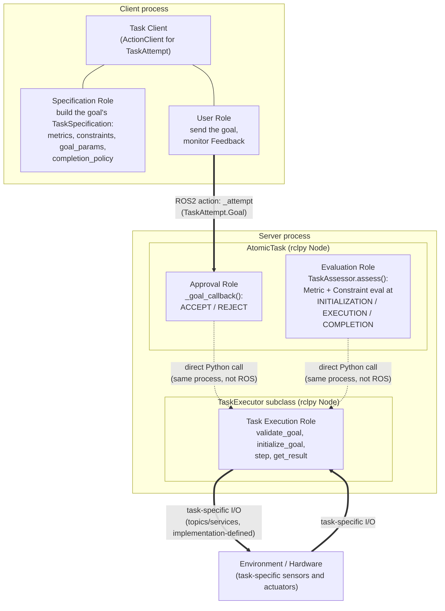
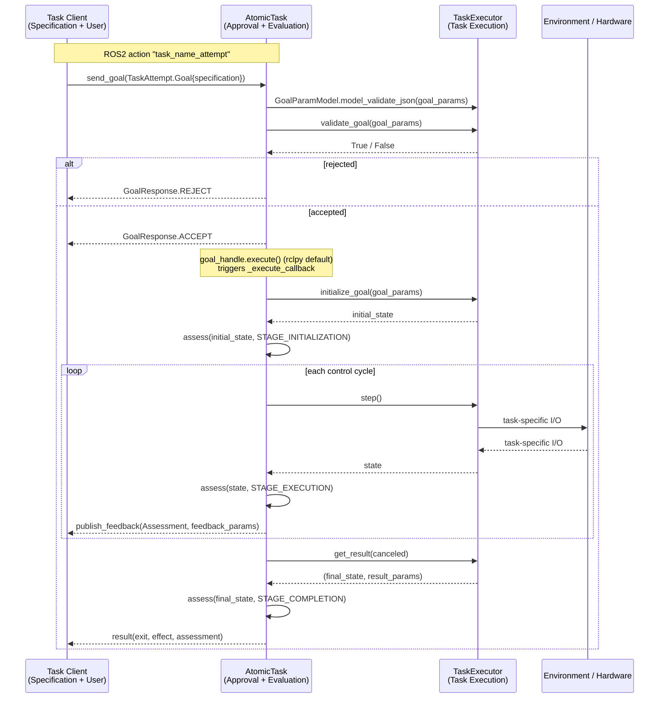

# Architecture: IEEE 1872.1 roles in `rtr_core`

`rtr_core` implements the task/goal/metric/constraint/outcome vocabulary of
IEEE Std 1872.1-2024 ("IEEE Standard for Robot Task Representation"). This
document shows where each of the standard's roles lives in the actual ROS2
node/process layout, and how a `TaskAttempt` action exchange flows between
them.

## Role → node mapping

| Standard role | Where it lives | `rtr_core` code |
|---|---|---|
| Specification | Task Client | builds the goal's `TaskSpecification` (metrics, constraints, `goal_params`, `completion_policy`) |
| User | Task Client | sends the goal, monitors `Feedback` |
| Approval | `AtomicTask` | `_goal_callback()` — ACCEPT / REJECT |
| Evaluation | `AtomicTask` | `TaskAssessor.assess()` via `self._assessor` |
| Task execution | `TaskExecutor` subclass | `validate_goal`, `initialize_goal`, `step`, `get_result` |

Three of the standard's five roles collapse into two ROS nodes: `AtomicTask`
plays both Approval and Evaluation, and a concrete `TaskExecutor` subclass
plays Task execution. The client plays both Specification and User.

The dotted arrows are the important detail: `AtomicTask` and the
`TaskExecutor` subclass are two separate `rclpy` nodes, typically spun in the
same `MultiThreadedExecutor` in one process, but they never talk to each
other over ROS. `AtomicTask` holds a plain Python reference to the executor
(`self._executor`) and calls its methods directly. The only ROS2 IPC in this
picture is the action between the client and `AtomicTask`, and whatever
task-specific topics/services the executor uses to talk to its environment
(a real robot, a simulator, or something else entirely) — that boundary is
deliberately outside `rtr_core`'s concern.

## Message flow over one attempt

Cancellation is a side channel not shown above: the client calls
`cancel_goal()`, `AtomicTask` calls `on_cancel()` on the executor, and the
execute loop notices `goal_handle.is_cancel_requested` on its next iteration
and breaks out into the same `get_result(canceled=True)` path.
